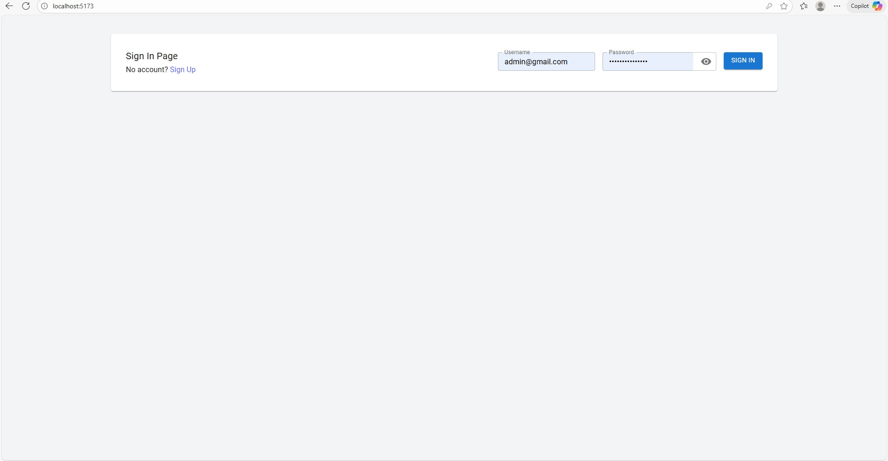
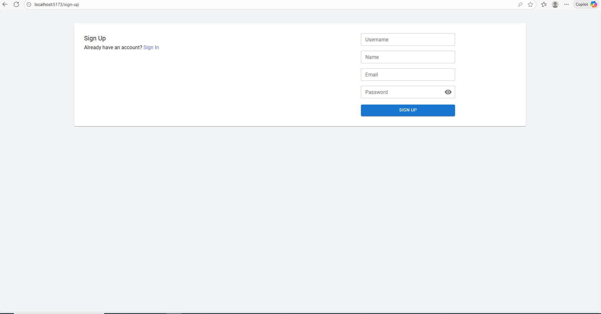
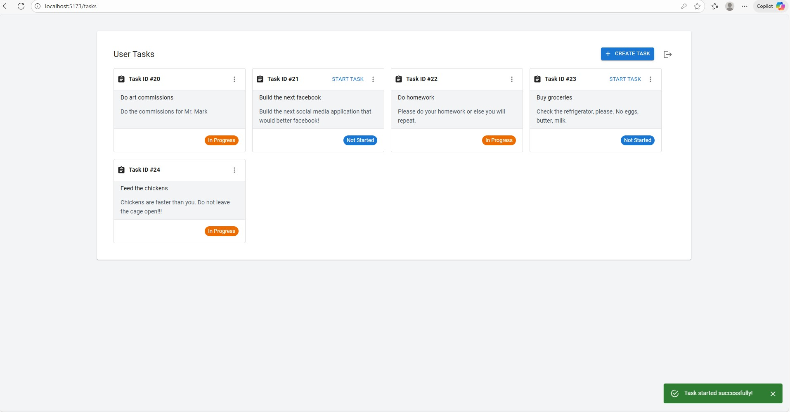
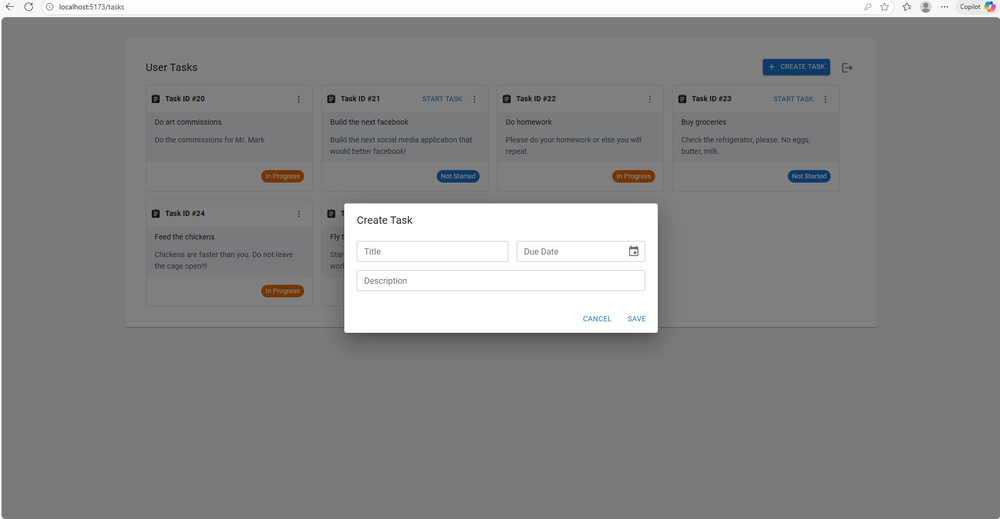

# 🧠 Task Manager — Technical Assessment

Hi **Digiteer Inc!** 👋  
I’m **Arnel De Asas**, your Fullstack Developer 😄

This project showcases my implementation of a **Task Management System**, built with a strong focus on **Clean Architecture principles** and a modern React frontend.

---

## 🧩 Overview

This project demonstrates my approach to building **structured, scalable, and maintainable** software — from backend architecture to a responsive frontend UI.

---

## ⚙️ Backend — ASP.NET Core Web API

### 🏗 Architecture
- Implemented using **Clean Architecture concepts**.  
  Not a full-blown version, but focused on the **core principles that matter most**:
  - **Dependency Inversion**
  - **Dependency flow toward the Domain/Application layer**
- Organized into multiple projects within the backend solution:
  - **Application Layer**
  - **Infrastructure-Database Layer**
  - **API Layer**

### 🧮 Data Management
- Custom **Repository Pattern** inspired by **CQRS**, for clean data handling and separation of commands and queries.
- Implemented **custom response models** to ensure consistent communication with the frontend.

### 🚨 Error Handling & Logging
- Added a **centralized middleware** for global error handling.
- Exceptions are allowed to bubble up to this middleware for uniform handling.
- Integrated **structured logging**, ready to connect with **Seq** for log aggregation.

---

## 💻 Frontend — React + Vite

### 🧱 Tech Stack Enhancements
Added several modern libraries to enhance development and user experience:
- **Material UI (MUI)** — For rich UI components.
- **Tailwind CSS** — For utility-first styling.
- **Yup** — For schema validation.
- **React Hook Form** — For flexible, declarative form handling.
- **Notistack** — For intuitive toast notifications.
- **TanStack Query** — For efficient API querying and state synchronization.

### 📄 Implemented Pages & Features
- **Sign In Page**
- **Sign Up Page**
- **Tasks Page** (enhanced UI)
- **Create Task Dialog**

Organized frontend into:
- `Mutations/`  
- `Queries/`  
- `Helpers/`  
- `Pages/`  
- `Components/`

---

## ✨ Features Implemented
✅ **End-to-End Working Features**
- User **Sign Up**
- User **Sign In**
- **Create Task**
- **Start Task**

⚙️ **Available but not yet wired to frontend**
- Update Task  
- Finish Task  
- Delete Task  

(All are working and tested via **Postman/Swagger UI**.)

---

## 🖼️ Screenshots

| Page | Screenshot |
|------|-------------|
| **Sign In** |  |
| **Sign Up** |  |
| **Tasks** |  |
| **Create Task Dialog** |  |

---

## 🧩 Summary

This assessment demonstrates how I:
- Transformed a simple starter codebase into a **layered, scalable application**
- Applied **Clean Architecture principles**
- Enhanced the **frontend experience** using modern React tools
- Delivered a **cleaner, more maintainable project structure**

---

**🚀 Thank you, Digiteer Inc!**  
This was an awesome challenge to work on — I hope it reflects how much I leveled up the given codebase 🙌  
— *Arnel De Asas*